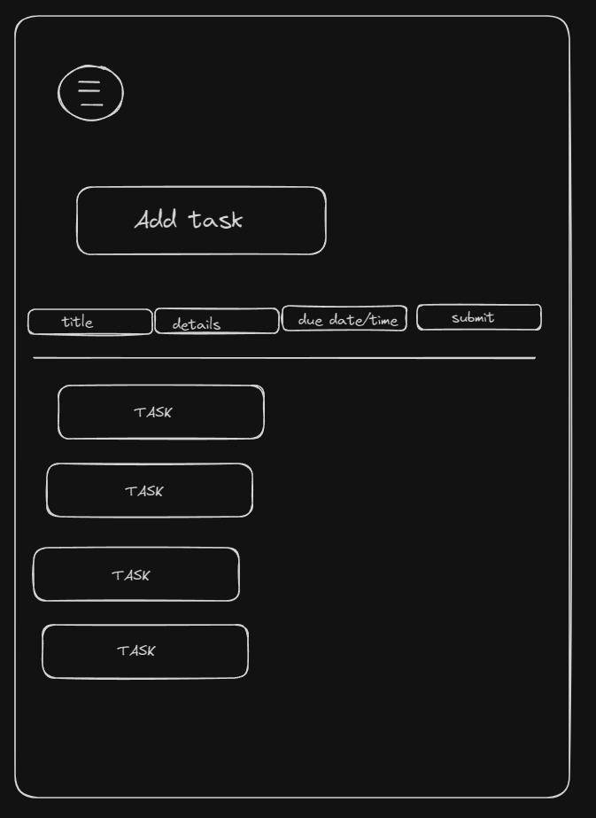

# App Desc: Users will be able to keep track of a list of items that need completing within a certain time period. The index page will present the list of items as well as a way to add tasks right at the top. The user will be able to edit and delete items from their list by clicking on an item. They will then be taken to a screen where they can freely edit or remove that particular item. There will be a hamburger menu at the top of the screen that can take them back to the home page.

-------------------------------------------------------------
# FRONTEND

## Dependencies
- React
- react-router-dom
- milligram
- Pure CSS
- styled-components
- react-dom
- foundation-sites

## ERD

## Route Map
| Route Name | Endpoint | Method | Description            |
| ---------- | -------- | ------ | ---------------------- |
| Create Account | / | POST | Create a new Task Account |
| User Auth | / | GET | Sign In to Account
| Index | /task | GET | All tasks |
| Create | /task | POST | Add a task |
| Index Update | /task | PUT | Change a task |
| Index Delete | /task | DELETE | Remove a task |
| Show | /:id | GET | Details for One task |
| Show Update | /:id | PUT | Change a task |
| Show Delete | /:id | DELETE | Remove a task |

------------------------------------------------------------
# FRONTEND

# Index

----------------------------------------------------
# Show

----------------------------------------------------
# Tree
